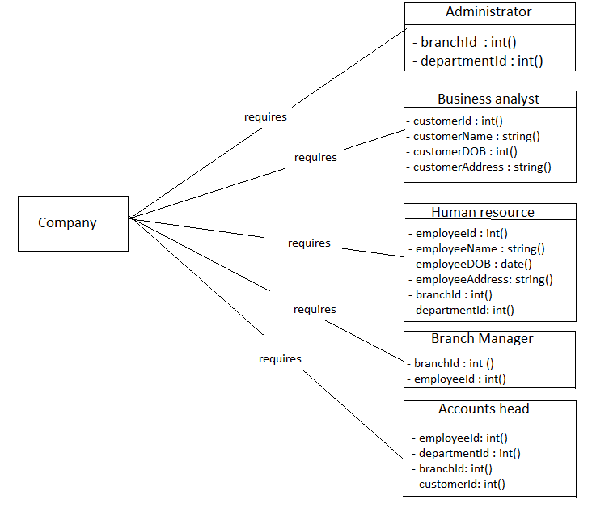

# Summery
  By visualizing the above probelm statement, we can identify that their is a requirement of objects that perform the jobs like manage customers, employees and calculate employee salary based on the band rate allowance, extra allowance and incentives.
  
## Requirements

| Functional requirments | Objects | Role | Responsibility |
| ---------------------- | ------- | ---- | -------------- |
| Manage departments and branches | Administrator | Maintain organization | look after the business operations |
| Customer relationship management | Business analyst | Manage customers | collect the customer requirments and generate an epic |
| list of employee by their catagory | Human resource | Manage employee by their catagory | work on employee facility |
| Manage branches | Branch manager | Maintain the branch | manage work of the employees |
| Salary calculation by employee id and manage customer bills | Accounts head | Calculate salary and customer billing | calculate salary regards to band rate of allowance with extra allowance and incentives, customer bills |

## Class diagram

